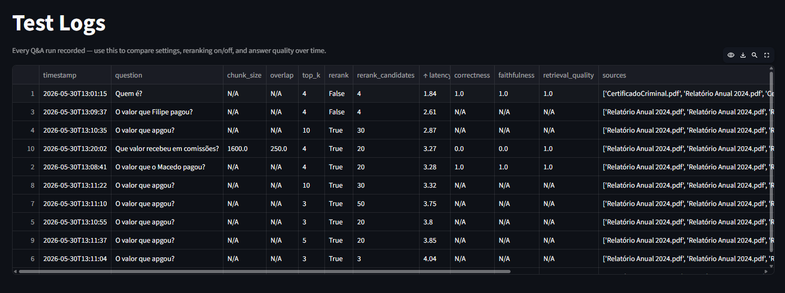

# RAG Playground

Built as a hands-on way to explore RAG internals: chunk sizes, overlap, retrieval strategies, evaluation metrics. And to share that learning with anyone else who wants to dig into how RAG actually works under the hood.

If you're here to learn, experiment, or just break things to see what happens: welcome.

---

A Streamlit app for building and evaluating a Retrieval-Augmented Generation (RAG) pipeline. Upload documents, ask questions against them, and benchmark retrieval and answer quality in a browser UI.

## Features

- **Document ingestion:** Upload PDF, TXT, or MD files. Text is chunked and embedded into a persistent ChromaDB vector store. Duplicate documents are detected by SHA-256 hash and skipped automatically.
- **Question answering:** Retrieves the top-K most relevant chunks via cosine similarity and generates an answer using GPT-4.1-mini, grounded strictly in the retrieved context.
- **Reranking:** Optional Cohere reranker that fetches a larger candidate pool first, then re-scores and filters down to the best Top K chunks before answering. Toggle it on/off to compare results.
- **Manual evaluation:** Provide an expected answer and a judge model (GPT-4.1) scores the response on correctness, faithfulness, and retrieval quality.
- **Automated eval set:** Generate question/answer pairs from indexed chunks and run a full evaluation sweep with Hit@K, MRR, correctness, faithfulness, and retrieval quality metrics.

## Setup

### 1. Install dependencies

```bash
pip install -r requirements.txt
```

### 2. Configure environment

Create a `.env` file in the project root:

```
OPENAI_API_KEY=sk-...
COHERE_API_KEY=...        # optional, only needed if you enable reranking
```

**Getting your OpenAI API key:**
1. Go to [platform.openai.com](https://platform.openai.com)
2. Sign in and navigate to **API keys** (top-right menu)
3. Click **Create new secret key**, give it a name, and copy it

**Getting your Cohere API key (for reranking):**
1. Go to [dashboard.cohere.com](https://dashboard.cohere.com)
2. Sign up for a free account, the free tier is enough for experimentation
3. Navigate to **API keys** and copy your key

> Never commit your `.env` file, it's already in `.gitignore`.

### 3. Run the app

```bash
streamlit run playground.py
```

## Usage

1. **Upload documents:** drag and drop one or more PDF/TXT/MD files and click **Index documents**.
2. **Ask a question:** type a question; the app retrieves relevant chunks and displays the answer with latency and source attribution.
3. **Evaluate manually:** enter an expected answer and click **Evaluate this answer** to get LLM-judge scores.
4. **Run automated eval:** use the slider to set the number of eval questions, click **Generate eval set**, then **Run evaluation** to see a full metrics table.

## Configuration (sidebar)

These settings are intentionally exposed so you can experiment and observe the effect on retrieval quality, answer accuracy, and latency. Tweak one at a time and use the eval suite to measure what changes.

**Chunk size** (default: 800)
Number of characters per chunk. Larger chunks give more context per retrieval but may dilute relevance and increase latency. Smaller chunks are more precise but may miss surrounding context.

**Chunk overlap** (default: 100)
Characters shared between consecutive chunks. Helps avoid cutting sentences or ideas at boundaries. Higher overlap means more chunks and slower indexing, but better continuity.

**Top K chunks** (default: 4)
How many chunks are retrieved and passed to the model as context. Increasing K gives the model more to work with but raises latency and cost, and too much irrelevant context can actually hurt answer quality. Watch the latency metric as you adjust this.

**Enable reranking (Cohere)**
When on, the app fetches a larger pool of candidates first, then runs Cohere's reranker to re-score and keep only the best Top K. The first-pass retrieval (vector similarity) is fast but approximate, the reranker is slower but much more precise. Toggle it on and off and run the eval suite to see the difference in retrieval quality and latency.

**Candidates to fetch before reranking** (default: 3x Top K)
How many chunks to pull from the vector store before reranking. More candidates gives the reranker more to work with, but increases the Cohere API call size. A good starting point is 3-5x your Top K.

## Models

The app uses different models for different roles. Using a stronger, separate model as the judge reduces self-preference bias (a model grading its own answers tends to be generous).

**Embeddings:** `text-embedding-3-small` converts text into vectors for semantic search. Fast and cost-efficient for this use case.

**Answer generation:** `gpt-4.1-mini` is lightweight and fast. Good baseline for testing retrieval quality without burning through budget.

**LLM judge:** `gpt-4.1` is used exclusively to evaluate answers. It scores correctness, faithfulness, and retrieval quality. Deliberately different from the answering model to give a more objective assessment.

> Want to experiment with different models? Swap `ANSWER_MODEL` or `JUDGE_MODEL` in the constants at the top of `playground.py` and re-run. Try a weaker answer model with a strong judge to expose retrieval gaps, or match them to see self-grading bias in action.

## Understanding the evaluation scores

After running the automated eval, you'll see five average scores:

**Hit@K:** whether the correct source chunk appeared anywhere in the top K retrieved results. 100% means every question had its source chunk retrieved.

**MRR (Mean Reciprocal Rank):** where in the ranked list the correct chunk appeared. 1.0 means it was always the first result. If it sometimes shows up 2nd or 3rd, this drops below 1.0.

**Correctness:** the judge model scores how well the actual answer matches the expected answer.

**Faithfulness:** checks whether the answer is grounded in the retrieved context and doesn't hallucinate facts not present in the documents.

**Retrieval quality:** the judge assesses whether the retrieved chunks actually contained the information needed to answer the question.

### Why your scores might look perfect

The eval questions are auto-generated from the chunks themselves, so retrieval is essentially matching a question back to its own source. Scores of 1.0 across the board are expected in this case.

To get a more honest picture, write your own questions manually, ones the model didn't generate. These will expose real gaps in retrieval and reasoning that the automated set won't catch.

## Learning RAG with this project

This project is designed so you can learn by doing. Here's a suggested path:

**1. Understand chunking**
Upload a document and try extreme chunk sizes, very small (200) and very large (1500). Ask the same question both times and compare the retrieved context. Small chunks are precise but may lose context; large chunks capture more but may retrieve noisy content.

**2. See retrieval in action**
Expand the "Retrieved context" section after asking a question. You'll see which chunks were pulled, which document they came from, and their similarity distance. Lower distance means more similar to your question.

**3. Learn what Top K does to latency**
Set Top K to 1, ask a question, note the latency. Then set it to 10 and ask the same question. Watch latency grow. Then check if the answer actually got better, often it doesn't, because extra chunks add noise.

**4. See why reranking matters**
Enable reranking with 20 candidates. Ask a question where the answer is buried in a document. Compare the retrieved chunks with reranking ON vs OFF. Cohere's model understands meaning, not just word similarity, so it often surfaces better chunks.

**5. Understand why eval scores look perfect**
Run the automated eval and notice Hit@K = 100% and MRR = 1.0. This is expected, the questions were generated from the chunks, so retrieval is just matching a question back to its source. Now write your own questions manually and use "Evaluate this answer" to get a real signal.

**6. Use the Logs page to compare experiments**
Every run is recorded. Change a setting, ask the same question, evaluate it, then go to the Logs page and compare latency and scores side by side. This is how you build intuition for which settings work for your documents.

**7. Understand the judge model**
The judge (GPT-4.1) is deliberately different and stronger than the answer model (GPT-4.1-mini). Try swapping `JUDGE_MODEL` to the same model as `ANSWER_MODEL` in `playground.py`. You'll likely see inflated scores because a model grading itself tends to be generous. This is called self-preference bias and it's a real problem in LLM evaluation.



## Project structure

```
playground.py        # Main Streamlit app
core/logs.py         # Log storage logic
pages/Logs.py        # Logs page
requirements.txt     # Python dependencies
.env                 # API keys (not committed)
chroma_db/           # Persistent vector store (auto-created)
rag_state.json       # UI state cache (auto-created)
rag_logs.jsonl       # Experiment logs (auto-created)
```
